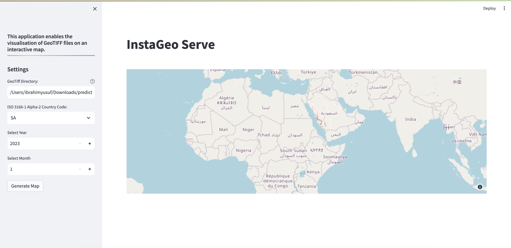

# InstaGeo - Apps (Serve)

## Overview
InstaGeo Serve is a web application that enables the visualization of HLS tile predictions created using InstaGeo Model component.

To visualize the predictions, a user simply needs to provide the absolute path of the parent directory containing the predictions in a specific format.

## Getting Started
The predictions need to be stored in a directory having the format `parent/directory/year/month`, where `month` is an integer representing the month, for example January is `1`.

1. **Launch the Application**: Initiate the Streamlit app by executing the command `streamlit run app.py` in your terminal. This will start the InstaGeo Serve application.

2. **Specify Options**: Upon starting the app, you'll be required to input the parent directory containing the prediction in the specified format. Also specify date information and country of interest.

3. **Explore Your Predictions on the Map**: After specifying the options, lick on `Generate Map` to fetch predictions for specified the date and country, which will be overlaid on an interactive map for exploration.

By streamlining the process of visualizing GeoTiff files, InstaGeo Serve aims to empower users with an efficient and accessible tool for visualizing model predictions.

## Dependencies
- Python 3.x
- Plotly
- Rasterio
- Xarray
- Datashader
- Streamlit

## Contribution
Contributions to enhance InstaGeo Serve are encouraged. Follow standard GitHub pull request procedures for collaboration.
